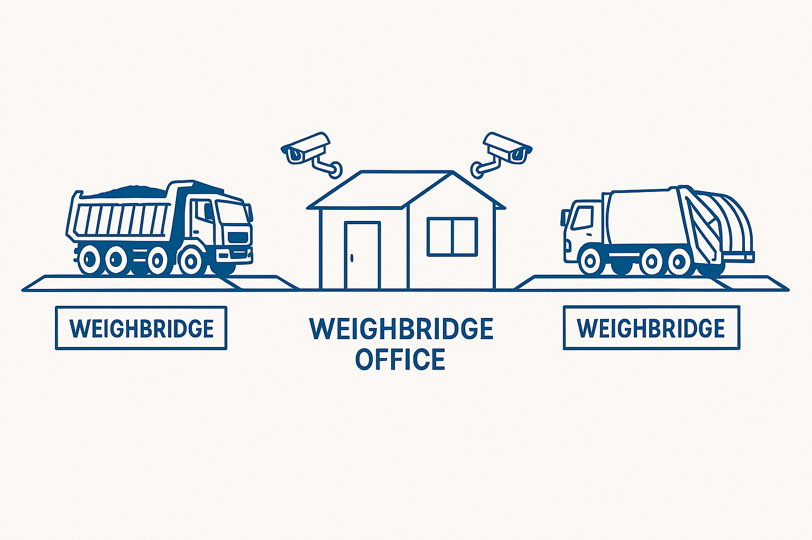

# Project Proposal: Automated Weighbridge System  

## **Overview**

This proposal outlines the implementation of an **automated weighbridge management system** at the Chunga dumpsite, utilizing existing Laumas WINOX-BR weighbridge controllers. The system will automate the measurement and tracking of vehicle weights at entry and exit, integrating license plate recognition (LPR) to accurately manage vehicle data and calculate garbage loads. Licence plates will be associated to collectors so no need for manual entry and for when a collector hires out a vehicle, they will need to register that vehicle on the platform as a temp vehicle for this collection task so that by the time the vehicle gets to the dump site that record will already be there.

---

## **Project Objectives**

- Automate and streamline weighbridge operations.
- Accurately track and record vehicle weights.
- Automatically recognize vehicles by their number plates.
- Maintain continuous operation with built-in redundancy and offline capabilities.
- Securely store data locally and synchronize to cloud services.

---

## **System Architecture**

The system involves the following key components:

1. **Existing Weighbridge Controllers:**
   - Two (2) Laumas WINOX-BR controllers (already available).
   - Connected via RS-485 communication protocol.

2. **IoT Gateway (LM Gateway 101 IoT-Lite):**
   - Polls weight data from controllers using Modbus RTU.
   - Centralized gateway capable of handling both weighbridge controllers through RS-485 multi-drop (daisy-chain) setup.

3. **Vehicle Detection Cameras:**
   - Four (4) REOLINK RLC-811A 4K IP cameras.
   - Positioned to automatically capture clear images of vehicle license plates from both directions of each weighbridge.

4. **Local Server (Mac Mini 2024 - M4 Chip):**
   - Performs Optical Character Recognition (OCR) locally to detect vehicle number plates.
   - Hosts local database for vehicle base weights, images, timestamps, and computed garbage weights.
   - Provides offline operational capability.

5. **Networking Infrastructure:**
   - Ethernet network using Cat6 cable, powered and connected through an 8-port PoE switch.

6. **Backup and Redundancy:**
   - Local data storage (Mac Mini internal storage).
   - External HDD for additional data backup.
   - Continuous data synchronization to cloud storage when internet is available.
   - Existing Uninterruptible Power Supply (UPS) ensures reliable power.

---

## **Detailed Workflow**

1. **Vehicle Arrival Detection:**  
   - Cameras detect vehicle approaching via motion sensors, capturing clear images.

2. **Weight Measurement:**  
   - Laumas WINOX-BR controllers measure vehicle weight.
   - LM Gateway polls data using Modbus RTU and timestamps the readings.

3. **License Plate Recognition:**  
   - Captured images processed by local OCR running on Mac Mini, extracting license plate numbers.

4. **Data Processing & Storage:**  
   - System retrieves vehicle base weight from the local database by recognized license plate.
   - Computes garbage weight (entry weight minus exit weight).
   - Data (weights, images, license plate, timestamp) stored locally, and periodically synchronized to the cloud.

5. **Offline Capability:**  
   - During internet outages, operations continue uninterrupted.
   - All data buffered locally, automatically synced once connectivity returns.

---

## **Comprehensive Equipment Costing and Justifications**

| Item                                      | Qty | Unit Cost | Total Cost | Justification |
|-------------------------------------------|-----|-----------|------------|---------------|
| **Existing Equipment**                    |     |           |            |               |
| Laumas WINOX-BR Controllers               | 2   | Owned     | $0         | Existing equipment already installed. |
| UPS Power Backup                          | 1   | Owned     | $0         | Existing equipment for reliable power. |
|                                           |     |           |            |               |
| **New Purchases**                         |     |           |            |               |
| LM Gateway 101 IoT-Lite                   | 1   | $120      | $120       | Robust industrial gateway supporting Modbus communication and multi-device setups. |
| REOLINK RLC-811A 4K Cameras               | 4   | $109      | $436       | High-resolution image capture, essential for accurate license plate recognition under various lighting conditions. |
| DB9-to-RS485 Adapters                     | 2   | $10       | $20        | Required for connecting existing DB9 serial ports to the RS-485 terminal of the gateway. |
| 120 Ω Termination Resistor                | 2   | $5        | $10        | Essential for reliable RS-485 communication. |
| PoE Switch (8-port)                       | 1   | $80       | $80        | Supplies power and network connectivity to cameras, simplifying cabling and installation. |
| Cat6 Ethernet Cable (100m spool)          | 1   | $50       | $50        | Reliable and high-speed data transmission. |
| Mac Mini 2024 (M4, 24GB RAM, 512GB SSD)   | 1   | $799      | $799       | Provides sufficient processing capability for OCR, local data handling, and future expansion. Compact and energy-efficient. |
| External HDD (1TB)                        | 1   | $60       | $60        | Secure local backup solution for data redundancy. |
| Mounting Hardware & Miscellaneous Supplies & external labor| 1   | $150      | $150       | Includes camera mounts, conduit, cable management. |
|                                           |     |           |            |               |
| **Software & Cloud Services**             |     |           |            |               |
| Local OCR (EasyOCR)                       | 1   | Free      | $0         | Efficient local license plate recognition without recurring fees. |
| Local Multimodal LLM (optional)           | 1   | Free      | $0         | Additional context for vehicle identification if required. |
| Cloud Storage (Annual Cost)               | 1   | $240/year | $240/year  | Reliable cloud backup and remote data access. |
|                                           |     |           |            |               |
| **TOTAL INITIAL INVESTMENT**              |     |           | **$1,965** | Cost-effective, high-performance automated solution. |

---

## **Built-in Redundancies and Reliability Measures**

- **Multi-drop RS-485 Setup:**  
  Robust multi-device communication from both weighbridge controllers using a single gateway reduces complexity.

- **Local OCR Processing:**  
  Independent of internet connectivity, ensuring continuous license plate recognition.

- **Local Data Storage & External HDD Backup:**  
  Ensures data integrity and continuity during outages.

- **UPS Power Backup:**  
  Existing backup ensures uninterrupted operation during power fluctuations.

- **Automatic Cloud Synchronization:**  
  Ensures data backup and availability once internet connectivity resumes, minimizing data loss risk.

---

## **Overall System Benefits**

- Improved operational efficiency and accuracy.
- Enhanced data integrity and redundancy.
- Significant reduction in manual labor and associated errors.
- Scalable infrastructure, adaptable to future operational expansions.
- On demand dumpsite data/

---

## **Conclusion and Recommendation**

The selected equipment and system design provide a comprehensive, cost-effective solution tailored to the Chunga Dumpsite operational requirements. The approach outlined ensures reliable, accurate, and uninterrupted operations, leveraging advanced yet affordable technologies. 

We recommend proceeding with this proposal, as it represents an optimal balance of performance, reliability, cost-efficiency, and scalability.

--- 

## **Next Steps**

- Proceed with procurement and installation.
- Schedule system configuration and integration.
- Develop Weighbridge Server software
